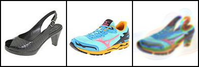
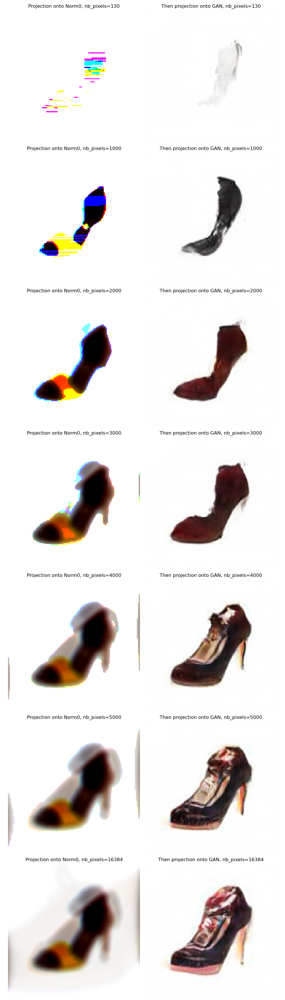

<h1 align="center">🌀 Wasserstein Morphing with mamGAN</h1>

<p align="center">
  <em>Wasserstein barycenter-based image morphing using the Method of Averaged Marginals (MAM), projected into the latent space of pretrained GANs.</em>
</p>

<p align="center">
  
  
  
  
  
  
</p>

---

## 🚀 Overview

This repository explores **image morphing** through **Wasserstein barycenters** computed in the **latent space of pretrained GANs**. It supports both:

- **Sinkhorn regularized OT**, and
- **MAM (Method of Averaged Marginals)**: an exact, operator-splitting-based OT solver see [our article for more](https://arxiv.org/pdf/2309.05315).

The morphing effect is achieved by computing Wasserstein barycenters between multiple images **after mapping them to a latent space**, then **re-generating images** using GANs.
This project aims to present an efficient and interpretable method to improve the realistic appearance and structural quality of Wasserstein barycenters, especially in the challenging case where **the barycenter involves more than two input images**.
By leveraging the Method of Averaged Marginals (MAM) and projecting barycenters into a generative latent space, the resulting morphings preserve both content fidelity and visual coherence.

<p align="center">
  
</p>

---

## 📦 Package Structure

```
mam_bary/
├── __init__.py
├── barycenter.py        # Entry point for barycenter(im1, im2, ...) or barycenter(images)
├── mam_algorithm.py     # Core MAM loop and DR-based projection
├── projections.py       # Projection onto simplex, ℓ0, GAN, convex constraints
├── generators.py        # DCGAN / Pix2Pix model loading and inference
├── metrics.py           # Cost matrices, Wasserstein distances
├── io.py                # Image loading, saving, result parsing
├── utils.py             # Helper functions: display, reshaping, task division
```

---

## 📊 Visualization

You can use `visualization.py` to load results stored in the `outputs/` folder and recreate visuals from the paper.

For example:
```bash
python visualization.py --input outputs/res_mamgan.pkl
```

---

## 📁 Other Folders

- **`post-treatment/`**: Contains utilities to convert generated images into **GIFs** or **videos**.
- **`utils/`**: Includes lightweight function sketches to help understand how MAM and latent-space projections operate.
- **`run_barycenter_of_pics_mamGAN.py`**: Uses 3 input images from a dataset and computes their barycenter via GAN projection.

---
## 🧩 Scientific Context and Foundations

This project is grounded in and extends the framework introduced by:

- 📘 **Mimouni et al., “Constrained Wasserstein Barycenters”**  
  [📄 Read the article](https://dan-mim.github.io/files/constrained_Wasserstein.pdf) | [🔗 GitHub](https://github.com/dan-mim/Constrained-Optimal-Transport)  
  This work proposes a **general operator-splitting approach** to compute Wasserstein barycenters under convex or nonconvex constraints — including projections onto generative manifolds or sparsity structures.  
  It formalizes the computation of barycenters with constraints using **Douglas–Rachford (DR) iterations** and shows how heuristic projections (e.g., onto GAN priors) can be efficiently integrated within this exact framework.

- 🖼️ **Simon et al., “Barycenters of Images with GANs”** [(arXiv:1912.11545)](https://arxiv.org/pdf/1912.11545)  
  [🔗 GitHub](https://github.com/drorsimon/image_barycenters)  
  This earlier work empirically demonstrated the value of computing **Sinkhorn barycenters in GAN latent space**, enabling visually coherent interpolations. However, it relied on entropic smoothing and lacked theoretical guarantees.

> 🧠 The contribution of Mimouni et al. can be seen as a **generalization** and **formalization** of the idea proposed by Simon et al., bringing a **rigorous optimization-based structure** to latent-space barycenter computation — particularly through the lens of constrained and nonconvex optimization.

This repository — **mamGAN** — directly implements that theoretical backbone, especially by exploiting the **heuristic projection mechanism introduced in the nonconvex case** of Mimouni et al. The result is a framework that is both **interpretable and performant**, capable of computing high-fidelity barycenters across a wide range of GANs and datasets.

---

## 🧠 Highlight: Method of Averaged Marginals (MAM)

- ✅ Exact solver for linear OT barycenter (no entropic smoothing)
- 🔄 Douglas–Rachford projection scheme
- 🔍 Scalable to large datasets, and adaptable to **constrained** and **projected** barycenters
- 🧩 Can be integrated with **GAN priors** and sparse regularizers

For more details, refer to:
- 📄 [Computing Wasserstein Barycenters via Operator Splitting (SIAM, 2024)](https://dan-mim.github.io/files/Computing_Wasserstein_Barycenters_via_operator_splitting.pdf)
- GitHub: https://github.com/dan-mim/computing-wasserstein-barycenters-MAM

---

## 🛠 Installation

```bash
git clone https://github.com/dan-mim/wasserstein-morphing-mamGAN.git
cd wasserstein-morphing-mamGAN
pip install -r requirements.txt
```

Make sure to install PyTorch and any GPU drivers as required for DCGAN or Pix2Pix inference.

---

## 🔧 Usage

```bash
python run_barycenter_of_pics_mamGAN.py \
  --image_1_path img1.jpg \
  --image_2_path img2.jpg \
  --image_3_path img3.jpg \
  --model pix2pix --projection gan --solver mam
```

<p align="center">
  
</p>

---

## 🎨 Artistic Visuals via ℓ⁰ Projection

Beyond projecting onto the GAN latent space, this project also investigates the effect of using an **ℓ⁰ (sparsity) projection** at each iteration of the MAM algorithm.  
Instead of constraining the barycenter to lie on a learned generative manifold, we enforce sparsity by projecting each color channel independently onto a sparse support — retaining only the most significant pixel intensities.

This constraint leads to **distinctive artistic outputs**: the resulting images display **poster-like aesthetics**, enhanced contrast, and bold geometric simplifications.  
Each color behaves autonomously, allowing for **creative decompositions** that amplify dominant structures while preserving the morphing behavior.

This experimental setting illustrates the versatility of constrained optimal transport not only as a mathematical optimization tool, but also as a framework for **aesthetic and interpretable visual synthesis**.

<p align="center">
  
</p>

---

## 📜 License

For academic use, please cite the original references listed above.

---
